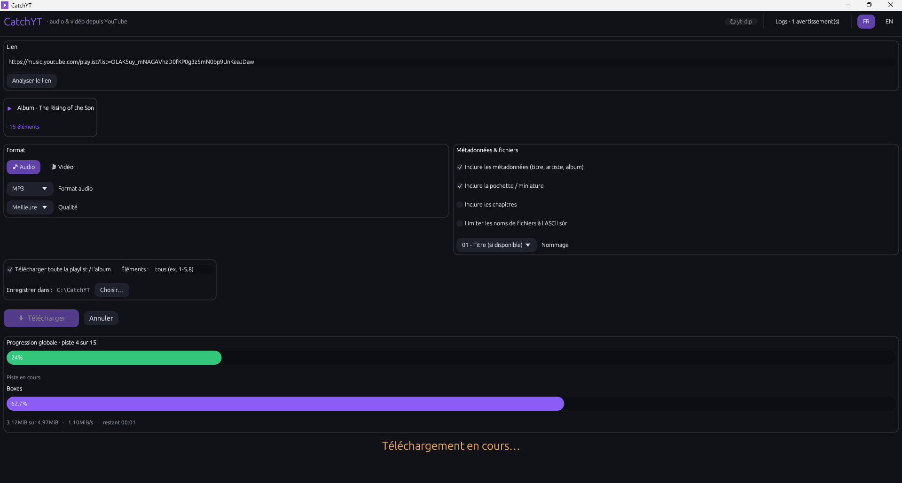

# CatchYT

**English** · [Français](README.fr.md)

[](https://github.com/V-Vaal/CatchYT/actions/workflows/build.yml)
[](https://github.com/V-Vaal/CatchYT/actions/workflows/audit.yml)
[](LICENSE)

A desktop downloader for **YouTube** and **YouTube Music**, written in **Rust** with a native **egui** interface. CatchYT drives `yt-dlp` and `ffmpeg` under the hood. It focuses first on audio extraction (tracks, albums, playlists), with metadata embedding, filename templating and format/quality selection.

<!-- Screenshot: drop the image in assets/ and reference it here, e.g.

-->

**Reading the project as a developer.** Two documents carry most of the reasoning, and both are in French: [`ARCHITECTURE.md`](ARCHITECTURE.md) is a guided tour of the code (module map, threading model, progress protocol, design decisions, extension recipes), and [`AUDIT.md`](AUDIT.md) is a security and code review of the project by itself, with the follow-up table of applied fixes. The source code and its comments are in English.

---

## Features

- **Audio or video** from a YouTube / YouTube Music URL (single item, playlist or album).
- **Audio formats**: MP3, FLAC, Opus, M4A (AAC), WAV, Ogg Vorbis, AAC, or the source stream with no re-encoding.
- **Quality**: best available, or a fixed bitrate (320 / 256 / 192 / 128 kbps) for lossy formats.
- **Video**: resolution up to 4K, container MP4 / MKV / WebM.
- **Metadata**: title, artist, album and track number embedded; cover art / thumbnail; chapters.
- **Naming**: automatic track numbering where available, ready-made templates (title, `Artist - Title`, playlist order, `Album / 01 - Track`), or a custom yt-dlp template.
- **Playlists and albums**: download everything, or a selection (`1-5,8`).
- **Live progress**: a bar for the current track plus overall album/playlist position.
- **Errors you can see**: job state shown large and centred (running / done / interrupted), a persistent banner naming the root cause, detailed logs hidden by default and available on demand.
- **Bilingual UI**: French by default, FR/EN toggle in the top bar (every string lives in `src/i18n.rs`).
- **Verified links**: only HTTPS URLs whose host is exactly YouTube / YouTube Music / youtu.be are accepted; paste with Ctrl+V or right-click.
- **Settings remembered**: language, format, quality, naming, output folder and options are saved to `%LOCALAPPDATA%\CatchYT\settings.json` and restored on the next launch.
- **One-click yt-dlp update**: the `↻ yt-dlp` button in the top bar, for when YouTube changes and downloads start failing.
- **No console window**, DPI-aware, configurable output folder.

### A note on FLAC

The YouTube source is **lossy** (Opus or AAC). Converting to FLAC produces a file that is lossless *as a container*, with **no actual quality gain** over the source. It is offered for library consistency, not to recover quality that was never in the original stream.

---

## First launch

CatchYT does **not** bundle `yt-dlp.exe`, `ffmpeg.exe` or `deno.exe` inside its binary. On first start it downloads them from their official GitHub repositories into:

```
%LOCALAPPDATA%\CatchYT\bin\
```

This is deliberate. Bundling `yt-dlp.exe` (a PyInstaller build) inside the executable markedly raises the odds of an antivirus false positive. Downloading on first launch keeps the main binary small and clean. Later launches reuse the cache. Budget roughly **230 MB of download** and **400 to 450 MB on disk** for the four executables (`yt-dlp`, `ffmpeg`, `ffprobe`, `deno`). Deno provides the JavaScript runtime that yt-dlp now recommends for YouTube.

Every download is **verified by SHA-256** before being installed: Deno is pinned (version and hash in the code), while yt-dlp and ffmpeg are checked against the checksums published alongside their release. The `↻ yt-dlp` button re-downloads the latest yt-dlp at any time.

---

## Getting the executable

### 1. From a release (nothing to install)

Go to [Releases](https://github.com/V-Vaal/CatchYT/releases) and download `catchyt.exe`. The release job attaches the artifact **that passed the tests**; it never rebuilds, so the published binary is the binary that was tested.

### 2. From a CI run

The `.github/workflows/build.yml` workflow compiles and tests on real Windows runners, then publishes the `.exe` as an artifact. Open the **Actions** tab, pick the latest completed `build` run, and download `catchyt-windows-x86_64` from the **Artifacts** section. Note that artifacts require a signed-in GitHub account and expire; a release asset does neither.

### 3. Building locally on Windows

Requires Rust, installed once from <https://rustup.rs> (default **MSVC** toolchain).

```powershell
git clone https://github.com/V-Vaal/CatchYT.git
cd CatchYT
powershell -ExecutionPolicy Bypass -File .\build.ps1
# or to build and run:
powershell -ExecutionPolicy Bypass -File .\build.ps1 -Run
```

The finished executable, ready to copy to another Windows x64 machine, is `catchyt.exe` at the project root. Cargo's intermediate file stays available at `target\release\catchyt.exe`.

The Visual C++ runtime is statically linked, so neither Rust nor the Visual C++ redistributable is required on the target machine. CatchYT is still a **portable executable that needs network on first launch**, not an offline distribution: it downloads `yt-dlp`, `ffmpeg`, `ffprobe` and `deno` into `%LOCALAPPDATA%\CatchYT\bin\`.

Or through cargo directly:

```powershell
cargo test --all
cargo build --release
```

---

## Portability

**No installation.** `catchyt.exe` is a single binary, statically linked against the C runtime (no Visual C++ redistributable required, only Windows system DLLs). No installer, no registry, no service: copying the executable is enough. The only disk writes are `%LOCALAPPDATA%\CatchYT\` (downloaded tools and `settings.json`) and the chosen output folder. Deleting that folder and the executable uninstalls everything.

**Desktop ports (Linux / macOS).** The code is ready: everything Windows-specific sits behind `cfg(windows)` with its Unix counterpart (executable names, permissions, console hiding), paths go through the `directories` crate, and CI compiles and tests the whole crate on Ubuntu at every push. The only real work is in `src/engine/deps.rs`, where the three bootstrap URLs point at Windows binaries and need per-OS variants (yt-dlp publishes `yt-dlp_linux` and `yt-dlp_macos`; Deno and ffmpeg have their own per-platform archives), plus producing the builds.

**Mobile.** The architecture, driving external yt-dlp/ffmpeg/deno executables, does not transpose as is. Android would need a backend embedding Python, along the lines of youtubedl-android, and iOS forbids spawning subprocesses altogether, so an iOS port would mean replacing the engine rather than adapting it.

---

## Antivirus and SmartScreen

An **unsigned**, freshly compiled Rust executable can trigger a **SmartScreen** warning ("unknown publisher") and, more rarely, an antivirus heuristic. That is true of any binary without reputation; it is not a symptom of a problem in the code.

What this project already does to minimise false positives:

- no third-party binaries bundled (dependencies are fetched on first launch);
- a proper Windows manifest and version metadata;
- a stripped release build with LTO, no obfuscated code and no suspicious patterns.

**The only way to actually eliminate the warnings is to sign the executable** with a code-signing certificate. See [`SIGNING.md`](SIGNING.md) for how to obtain and use one.

---

## Project layout

> For a guided tour of the code (architecture, threading, progress protocol, design decisions, extension recipes), see [`ARCHITECTURE.md`](ARCHITECTURE.md). It is written in French.

```
src/
  main.rs              entry point (hides the console in release)
  lib.rs               library root
  app.rs               egui interface (state, options, progress)
  i18n.rs              FR / EN interface strings
  settings.rs          settings persistence (JSON, tolerant loading)
  theme.rs             palette / style
  engine/
    mod.rs             re-exports
    options.rs         DownloadOptions + yt-dlp argument builder (the tested core)
    deps.rs            yt-dlp + ffmpeg/ffprobe + Deno bootstrap on first launch
    probe.rs           metadata preview (title, playlist, item count)
    runner.rs          yt-dlp execution + progress parsing
tests/
  engine_integration.rs   integration tests (+ opt-in e2e test)
assets/                icons
.github/workflows/     CI (build + test + exe artifact) and RUSTSEC audit
build.rs               Windows resources (icon, manifest, version)
build.ps1              local Windows build
```

---

## Tests

```powershell
cargo test --all
```

The real network bootstrap, with no YouTube download, is opt-in:

```powershell
$env:CATCHYT_BOOTSTRAP_E2E="1"; cargo test -- --ignored e2e_bootstraps_dependencies
```

Unit tests cover argument construction (every format, quality and naming combination), progress parsing and URL validation. A real **end-to-end** test, downloading a short video, is disabled by default:

```powershell
$env:CATCHYT_E2E="1"; cargo test -- --ignored e2e_downloads_audio
```

CI runs it automatically on the Windows job, non-blocking in case YouTube rate-limits the runner's IP.

---

## Legal

Downloading content from YouTube may breach its terms of service and, depending on the content, copyright. This tool is meant for legitimate use: content you own, content under a free licence, or content you are otherwise allowed to use. You are responsible for how you use it.

## Licence

MIT. CatchYT only drives `yt-dlp` (Unlicense), `ffmpeg` (LGPL/GPL depending on the build) and Deno (MIT), each downloaded separately.
